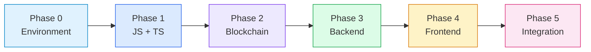
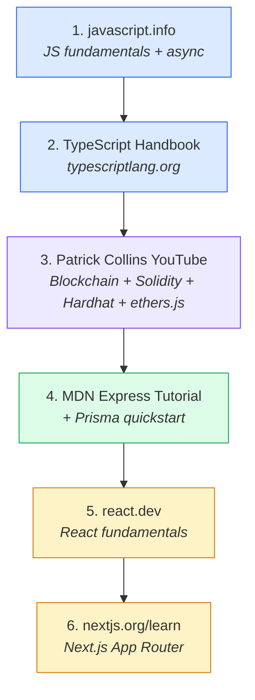

<style>
  /* ── Base Typography ── */
  body {
    font-family: 'Inter', 'Segoe UI', system-ui, -apple-system, sans-serif;
    line-height: 1.75;
    color: #1e293b;
    max-width: 52em;
    margin: 0 auto;
    padding: 2em 1.5em;
  }

  /* ── Headings ── */
  h1 {
    border-bottom: 3px solid #2563eb;
    padding-bottom: 10px;
    margin-bottom: 0.6em;
    font-weight: 800;
    letter-spacing: -0.02em;
    color: #0f172a;
  }
  h2 {
    border-left: 4px solid #2563eb;
    padding-left: 14px;
    margin-top: 2.4em;
    margin-bottom: 0.8em;
    font-weight: 700;
    color: #0f172a;
  }
  h3 {
    color: #1e40af;
    margin-top: 1.6em;
    margin-bottom: 0.5em;
    font-weight: 600;
  }

  /* ── Paragraphs & Lists ── */
  p { margin: 0.8em 0; }
  ul, ol { padding-left: 1.4em; }
  li {
    margin-bottom: 0.5em;
    line-height: 1.7;
  }
  li > strong { color: #0f172a; }

  /* ── Tables ── */
  table {
    width: 100%;
    border-collapse: separate;
    border-spacing: 0;
    margin: 1.2em 0;
    border-radius: 8px;
    overflow: hidden;
    box-shadow: 0 1px 3px rgba(0,0,0,0.08);
    font-size: 0.93em;
  }
  th {
    background-color: #1e3a5f;
    color: #fff;
    padding: 10px 14px;
    text-align: left;
    font-weight: 600;
    letter-spacing: 0.02em;
  }
  td {
    padding: 9px 14px;
    border-bottom: 1px solid #e2e8f0;
  }
  tr:nth-child(even) { background-color: #f0f4f8; }
  tr:last-child td { border-bottom: none; }
  tr:hover { background-color: #e8eef6; transition: background 0.15s ease; }

  /* ── Blockquotes ── */
  blockquote {
    border-left: 4px solid #f59e0b;
    background: #fffbeb;
    padding: 14px 18px;
    border-radius: 6px;
    margin: 1.4em 0;
    color: #92400e;
    font-style: normal;
  }
  blockquote strong { color: #78350f; }

  /* ── Code ── */
  code {
    background: #f1f5f9;
    padding: 2px 6px;
    border-radius: 4px;
    font-size: 0.88em;
    color: #334155;
    font-family: 'JetBrains Mono', 'Fira Code', 'Cascadia Code', monospace;
  }
  pre {
    background: #0f172a;
    color: #e2e8f0;
    padding: 1.2em 1.4em;
    border-radius: 8px;
    overflow-x: auto;
    margin: 1.2em 0;
    line-height: 1.6;
    box-shadow: 0 2px 6px rgba(0,0,0,0.15);
  }
  pre code {
    background: none;
    padding: 0;
    color: inherit;
    font-size: 0.9em;
  }

  /* ── Links ── */
  a {
    color: #2563eb;
    text-decoration: none;
    border-bottom: 1px solid transparent;
    transition: border-color 0.2s ease;
  }
  a:hover {
    border-bottom-color: #2563eb;
  }

  /* ── Horizontal Rules ── */
  hr {
    border: none;
    height: 1px;
    background: linear-gradient(to right, transparent, #cbd5e1, transparent);
    margin: 2.5em 0;
  }

  /* ── Callout Boxes (:::info, :::warning, :::tip) ── */
  .markdown-alert-note,
  .markdown-alert {
    border-radius: 8px;
    padding: 14px 18px;
    margin: 1.2em 0;
    font-size: 0.93em;
    line-height: 1.65;
  }

  /* ── Checkboxes ── */
  input[type="checkbox"] {
    accent-color: #2563eb;
    transform: scale(1.15);
    margin-right: 6px;
    vertical-align: middle;
  }

  /* ── Mermaid Diagrams ── */
  .mermaid {
    margin: 1.5em 0;
    text-align: center;
  }
</style>

# FIDELIO --- Full Learning Plan

> **Goal:** Be able to read every file, execute every app, and understand every decision in the FIDELIO project.
>
> **Your foundation:** C++ --- which gives you a head start on typed languages, memory models, and Solidity's syntax.
>
> **Architecture reference:** See `Fidelio-Architecture-Plan.md` for the full 7-component system, data flows, and tech stack decisions.

[TOC]

---

## Roadmap at a Glance



### Timeline

| Weeks | Phase | Focus |
|-------|-------|-------|
| 1 | 0 | Environment setup, Git, Node.js, npm, Turborepo |
| 2--3 | 1 | JavaScript fundamentals, then TypeScript |
| 4--5 | 2.1--2.2 | Blockchain concepts, Solidity |
| 6 | 2.3--2.5 | Hardhat, ethers.js, Gnosis Safe |
| 7--8 | 3 | Express.js, PostgreSQL, Prisma, BAC integration |
| 9--11 | 4 | React, Next.js, TailwindCSS |
| 12 | 5 | Full integration, codebase reading, verification |

**Total: ~12 weeks** at steady pace. Faster full-time; slower part-time. Each phase unlocks the next --- don't skip ahead.

---

## Phase 0: Developer Environment & Tooling

:::info Estimated Time
~1 week
:::

Before writing any code, you need the tools every component depends on.

- [ ] **0.1 --- Terminal & Shell Basics**

  You'll spend most of your time in a terminal. If you're already comfortable with `cd`, `ls`, `mkdir`, pipes, and environment variables, skip ahead. Otherwise, spend a day getting fluent --- everything that follows assumes you can navigate the filesystem and run commands confidently.

- [ ] **0.2 --- Git & GitHub**

  The FIDELIO monorepo lives in Git. You need to understand commits, branches, merges, pull requests, and `.gitignore`. Learn the everyday workflow: clone, branch, commit, push, pull request, merge. Knowing how to read a `git log` and resolve a merge conflict will save you real pain later.

- [ ] **0.3 --- Node.js & npm**

  Every off-chain component (backend, frontend, even contract tests) runs on Node.js and uses npm for package management. Install **Node.js 20 LTS**. Learn what `package.json` does, how `npm install` resolves dependencies, and what `node_modules` is. Understand the difference between `dependencies` and `devDependencies`. The project uses **npm workspaces** (monorepo), so also read how workspaces let multiple packages share a single `node_modules` tree.

- [ ] **0.4 --- Turborepo (Monorepo Orchestration)**

  FIDELIO uses Turborepo to coordinate builds across `packages/contracts`, `packages/backend`, and `packages/web`. Learn what `turbo.json` does --- it defines a dependency graph so that `turbo run build` builds contracts *before* backend (because backend imports contract ABIs). You don't need deep expertise, just enough to run `turbo run dev` and understand why things build in a certain order.

### Resources for Phase 0

| Topic | Resource | Format |
|-------|----------|--------|
| Terminal | *The Linux Command Line* by William Shotts | Free book --- [linuxcommand.org](https://linuxcommand.org) |
| Git | *Pro Git* by Scott Chacon | Free book --- [git-scm.com/book](https://git-scm.com/book) |
| Git | GitHub's own guides | Free online |
| Node.js | Official docs after installing 20 LTS | [nodejs.org](https://nodejs.org) |

---

## Phase 1: JavaScript to TypeScript

:::info Estimated Time
~3 weeks (2 weeks JS + 1 week TS)
:::

C++ gives you a strong intuition for types, compilation, and structured thinking. TypeScript is the single language that ties together the backend, frontend, and contract tests in FIDELIO.

- [ ] **1.1 --- JavaScript Fundamentals**

  Start here even though the project uses TypeScript, because TypeScript is a superset of JavaScript. Focus on the parts that **differ most from C++**:

  | Concept | What to learn | C++ comparison |
  |---------|---------------|----------------|
  | Dynamic typing | Why `"5" + 3` gives `"53"` | C++ enforces types at compile time; JS doesn't |
  | First-class functions | Passing functions as arguments, arrow functions (`=>`), closures | Like function pointers, but far more flexible |
  | Async programming | Callbacks, Promises, `async/await` | C++ uses threads/futures; JS is single-threaded with an event loop |
  | Objects & destructuring | `const { name, balance } = user` | Like untyped structs with syntax sugar |
  | Array methods | `map`, `filter`, `reduce`, `find` | Like `<algorithm>` but used instead of for-loops |
  | Modules | `import`/`export` syntax (ES modules) | Like `#include` but with explicit exports |

  :::warning Mental Shift Required
  **Async programming is the biggest jump from C++.** C++ uses threads and mutexes; JavaScript uses a single-threaded event loop with Promises. The backend makes API calls to BAC Credomatic, reads from the blockchain, and queries the database --- all asynchronous. Invest extra time here.
  :::

- [ ] **1.2 --- TypeScript**

  Once JS clicks, TypeScript adds the type layer you're already comfortable with from C++.

  | Concept | What to learn | C++ comparison |
  |---------|---------------|----------------|
  | Type annotations | `let balance: number = 500;` | Feels like C++ declarations |
  | Interfaces & types | Shaping data for APIs, DB models, contracts | Like structs/classes but for data shape |
  | Generics | `Array<T>`, `Promise<T>` | Same concept as C++ templates, simpler syntax |
  | Enums | `TransactionStatus.PENDING` | Same as C++ enums |
  | `tsconfig.json` | Compiler config: `strict`, `target`, `module` | Like CMakeLists.txt compiler flags |
  | Type narrowing | Safe downcasting with guards | Like `dynamic_cast` but at the type-checker level |

### Resources for Phase 1

| Topic | Resource | Notes |
|-------|----------|-------|
| JavaScript | [javascript.info](https://javascript.info) | **Best single resource.** Free, thorough, written for people who know another language. Read "JS Fundamentals" and "Promises, async/await" first. Skip browser DOM sections. |
| TypeScript | [TypeScript Handbook](https://typescriptlang.org/docs/handbook) | Official, well-written, free |
| TypeScript | [Total TypeScript](https://totaltypescript.com) by Matt Pocock | Free interactive exercises. "Beginners TypeScript" tutorial is excellent |
| Practice | [Exercism.io](https://exercism.io) --- JS & TS tracks | Real exercises with mentor review, free |

---

## Phase 2: Blockchain & Smart Contracts

:::info Estimated Time
~3 weeks (concepts + Solidity + tooling)
:::

> **FIDELIO context:** This phase covers **Component 1** (CATRToken.sol --- ERC-20 with 0.63% commission, tier limits, Dead Man's Switch), **Component 7** (Gnosis Safe 2/2 multi-sig), and the on-chain layer that the backend interacts with via ethers.js.

Your C++ background is a genuine advantage here --- Solidity's syntax is C-like, it has explicit types, and you already understand concepts like memory vs. storage.

- [ ] **2.1 --- Blockchain Concepts (No Code Yet)**

  Before touching Solidity, build a mental model of what blockchains actually do:

  | Concept | What it is | Analogy |
  |---------|-----------|---------|
  | Blockchain | An append-only ledger maintained by a decentralized network | Like a public notebook where entries can't be erased |
  | Ethereum | Accounts (EOA vs. contract), gas, transactions, EVM | The EVM is a global computer that runs your contract code |
  | Base | Ethereum Layer 2 --- same EVM, cheaper transactions | FIDELIO deploys here |
  | ERC-20 | Standard interface for fungible tokens (`balance`, `transfer`, `approve`) | CATR is an ERC-20 with custom commission logic on top |
  | Wallets & keys | Public/private key pairs, signing transactions | Like SSH keys but for money |
  | Testnets | Base Sepolia --- free testing network | Deploy here before mainnet |

- [ ] **2.2 --- Solidity**

  Solidity is the language for `CATRToken.sol`. Learn in this order:

  | Concept | What to learn | C++ comparison |
  |---------|---------------|----------------|
  | Basic syntax | `uint256`, `address`, `mapping`, `struct`, `require()` | `mapping` = `std::unordered_map`; `require()` = `assert` that reverts |
  | Contract structure | State variables, constructor, functions, events, modifiers | Like a class: members, constructor, methods, logging, decorators |
  | Inheritance + OpenZeppelin | `is ERC20, Pausable, AccessControl` | Like C++ multiple inheritance via `is` keyword |
  | Access control | Roles (`ADMIN`, `MINTER`), `onlyRole` modifier | Why roles instead of a single owner --- separation of power |
  | Custom transfer logic | The 0.63% commission inside overridden `_transfer` | Like intercepting a virtual function in a base class |
  | Security patterns | Reentrancy guards, overflow (handled natively in 0.8+), pause | Maps to C++ defensive programming instincts |

  :::tip C++ Bridge
  **Solidity feels the most familiar.** Explicit types (`uint256`, `address`), functions with visibility modifiers, inheritance, and memory management concepts (`storage` vs `memory` is like heap vs stack in C++). Smart contract security maps to your C++ instincts about bounds checking, input validation, and avoiding undefined behavior.
  :::

- [ ] **2.3 --- Hardhat**

  Hardhat is the development environment for smart contracts --- it compiles, tests, deploys, and debugs Solidity code.

  | Tool | What it does | C++ equivalent |
  |------|-------------|----------------|
  | `hardhat.config.ts` | Network settings, compiler version | Like CMakeLists.txt |
  | `npx hardhat compile` | Generates ABIs (Application Binary Interfaces) | ABIs are like C++ header files --- they tell other code how to call contract functions |
  | Tests (Mocha/Chai) | `expect(await token.balanceOf(user)).to.equal(500)` | Like GTest assertions |
  | `scripts/deploy.ts` | Deploys contract to Base Sepolia | Like a build-and-flash script |
  | `npx hardhat console` | Live REPL connected to testnet | Like GDB but for blockchain |

- [ ] **2.4 --- ethers.js v6**

  The JavaScript library that lets the backend talk to the blockchain. Every mint, burn, and transfer in FIDELIO goes through ethers.js.

  | Concept | What it does |
  |---------|-------------|
  | Providers | Connect to a blockchain node (like connecting to a database) |
  | Signers | A wallet that can sign transactions. Backend uses a signer with the MINTER role |
  | Contract instances | `new ethers.Contract(address, abi, signer)` --- call `contract.mint(...)`, `contract.transfer(...)` |
  | Events & listeners | Listen for on-chain events (e.g., "Transfer") to update the database |
  | Gas & receipts | Send a transaction and wait for confirmation |

- [ ] **2.5 --- Gnosis Safe (Conceptual)**

  No custom code --- just understand what a multi-sig wallet is (requires N-of-M signatures to execute), why FIDELIO uses 2-of-2 (founder + lawyer), and how the Safe web interface works. Visit [safe.global](https://safe.global) and create a test Safe on Base Sepolia.

### Resources for Phase 2

| Topic | Resource | Notes |
|-------|----------|-------|
| Blockchain concepts | [ethereum.org/learn](https://ethereum.org/en/learn) | Maintained by the Ethereum Foundation, organized by level |
| **All of Phase 2** | Patrick Collins' YouTube course (32h, free) | *"Learn Blockchain, Solidity, and Full Stack Web3 Development"* --- covers 2.1 through 2.4 almost entirely in one shot |
| Solidity | [CryptoZombies](https://cryptozombies.io) | Gamified, free, best hands-on intro |
| Solidity | [Solidity by Example](https://solidity-by-example.org) | Real contract code snippets per concept |
| OpenZeppelin | [docs.openzeppelin.com/contracts](https://docs.openzeppelin.com/contracts) | Bookmark ERC20, Pausable, and AccessControl pages specifically |
| Hardhat | [hardhat.org/tutorial](https://hardhat.org/tutorial) | Short, practical, do it start to finish |
| ethers.js v6 | [docs.ethers.org/v6](https://docs.ethers.org/v6) | Focus on "Getting Started" and "Contracts" sections |
| Base (L2) | [docs.base.org](https://docs.base.org) | Quickstart for deploying on Base Sepolia |
| Gnosis Safe | [safe.global](https://safe.global) | Just create a test wallet and click around |

---

## Phase 3: Backend (Off-Chain)

:::info Estimated Time
~2 weeks
:::

> **FIDELIO context:** This phase covers **Component 2** (Backend API --- Express.js, the "oracle" bridge between BAC Credomatic payments and the blockchain) and **Component 4** (PostgreSQL database with 8 core tables: `users`, `wallets`, `merchants`, `transactions`, `redemption_requests`, `reward_milestones`, `merchant_visits`, `referrals`).

The backend is the bridge between the real world and the blockchain. It's a Node.js/Express.js API written in TypeScript.

- [ ] **3.1 --- Express.js**

  Express is a minimal web server framework.

  | Concept | What to learn | FIDELIO usage |
  |---------|---------------|---------------|
  | Routes | `app.post('/api/payments', handler)` maps HTTP requests to functions | Routes for payments, redemptions, rewards, referrals, users, admin |
  | Middleware | Functions that run before your route handler | Auth checks, logging, error handling |
  | Request/Response | `req.body` = incoming data, `res.json()` = send back JSON | Every API endpoint |
  | Error handling | Centralized error middleware, `try/catch` with async routes | Catches blockchain failures, payment errors |

- [ ] **3.2 --- PostgreSQL & Prisma ORM**

  The database stores everything that doesn't belong on-chain.

  | Concept | What to learn |
  |---------|---------------|
  | SQL basics | `SELECT`, `INSERT`, `UPDATE`, `JOIN`, `WHERE`. Relational tables, primary keys, foreign keys |
  | Prisma | Define schema in `schema.prisma`, run `npx prisma migrate dev`, query with `prisma.user.findUnique({ where: { id } })` |
  | FIDELIO schema | The 8 core tables and how they relate to each other |

  :::tip Key Distinction
  **What's NOT in the database:** Token balances, commission calculations, transfer rules --- these live on-chain as the source of truth. The database *caches* them for display speed but the blockchain is authoritative.
  :::

- [ ] **3.3 --- BAC Credomatic Payment Integration**

  The backend receives payment confirmations from BAC's Payment Execution API and mints CATR in response.

  | Concept | What to learn |
  |---------|---------------|
  | REST API concepts | HTTP methods (GET, POST), headers, status codes, JSON payloads |
  | Webhooks | BAC sends a POST to your backend when payment succeeds --- `payments.ts` validates and triggers mint |
  | API authentication | API Key + Secret as headers. Sandbox at `developer-test.baccredomatic.com` |

- [ ] **3.4 --- Background Jobs & Cron**

  The heartbeat cron pings the smart contract every 24 hours to prevent the Dead Man's Switch from triggering. Learn how to schedule recurring tasks in Node.js (libraries like `node-cron` or `bull`). Simple pattern: set a timer, call a function, handle failures with retries and logging.

### Resources for Phase 3

| Topic | Resource | Notes |
|-------|----------|-------|
| Express.js | MDN Express/Node.js tutorial | Most practical free guide --- builds a real app from scratch. Search "Express web framework" on developer.mozilla.org |
| SQL | [SQLBolt](https://sqlbolt.com) | Interactive browser exercises, free, ~3--4 hours |
| PostgreSQL | [PostgreSQL Tutorial](https://postgresqltutorial.com) | PostgreSQL-specific flavor after SQLBolt |
| Prisma | [prisma.io/docs](https://prisma.io/docs) | Excellent. Do "Getting Started" quickstart, then "Schema" and "CRUD" sections |
| REST/HTTP | Postman Learning Center | Free API fundamentals course: HTTP, REST, webhooks, auth --- exactly what BAC integration needs. [learning.postman.com](https://learning.postman.com) |

---

## Phase 4: Frontend (Off-Chain)

:::info Estimated Time
~3 weeks
:::

> **FIDELIO context:** This phase covers **Component 3** --- one Next.js app with three role-based interfaces (client mobile-first, merchant desktop-friendly, admin operator). Shared codebase, different views depending on who logs in. Like having one multi-meter instead of separate voltmeter, ammeter, and ohmmeter.

- [ ] **4.1 --- React Fundamentals**

  React is a UI library where you build interfaces out of reusable components.

  | Concept | What to learn | FIDELIO usage |
  |---------|---------------|---------------|
  | Components | Functions that return JSX (HTML-like syntax in JS) | Every page and widget |
  | Props | Data passed from parent to child, like function arguments | Passing balances, user data |
  | State | `useState` hook --- when state changes, React re-renders | CATR balance display, form inputs |
  | Effects | `useEffect` hook --- fetch data from backend API on load | Loading transaction history |
  | Events | `onClick`, `onSubmit` | "Pay Merchant" button triggers transaction |

- [ ] **4.2 --- Next.js 14**

  Next.js wraps React with routing, server-side rendering, and API routes.

  | Concept | What to learn |
  |---------|---------------|
  | App Router | `app/` directory structure defines routes. `app/(client)/wallet/page.tsx` becomes `/wallet`. Parenthetical folders are route groups that don't affect the URL |
  | Server vs Client Components | Next.js 14 renders on server by default. Components needing browser APIs use `"use client"` |
  | API Routes | `app/api/*/route.ts` can handle simple backend logic (though FIDELIO's main backend is separate) |
  | SSR + mobile performance | Server sends pre-rendered HTML so users see content before JS loads |

- [ ] **4.3 --- TailwindCSS**

  Utility-first CSS framework. Instead of writing CSS files, you add classes directly to elements (`className="bg-blue-500 text-white p-4"`). Fast to learn, used for all styling in the project.

### Resources for Phase 4

| Topic | Resource | Notes |
|-------|----------|-------|
| React | [react.dev](https://react.dev) | **Best React resource.** Rewritten in 2023, teaches hooks-first. Start with "Learn React" interactive tutorial |
| Next.js | [nextjs.org/learn](https://nextjs.org/learn) | Official guided course by Vercel. Free, ~10--15 hours, uses App Router |
| TailwindCSS | [tailwindcss.com/docs](https://tailwindcss.com/docs) | "Core Concepts" section + [play.tailwindcss.com](https://play.tailwindcss.com) for browser experiments |

---

## Phase 5: Putting It All Together

:::info Estimated Time
~1 week
:::

- [ ] **5.1 --- Run the Full Stack Locally**

  ```bash
  # 1. Clone and install
  git clone <repo-url> && cd HNDA
  npm install

  # 2. Compile contracts (generates ABIs)
  npx hardhat compile            # in packages/contracts

  # 3. Run contract tests
  npx hardhat test               # read every test to understand expected behavior

  # 4. Deploy to testnet
  npx hardhat run scripts/deploy.ts --network baseSepolia

  # 5. Start backend
  cd packages/backend && npm run dev

  # 6. Start web app
  cd packages/web && npm run dev

  # 7. Walk through the full transaction cycle:
  #    buy CATR -> pay merchant -> merchant redeems
  ```

- [ ] **5.2 --- Read the Codebase End-to-End**

  Trace the data flow through the actual code:

  ```mermaid
  graph TD
      A[BAC payment webhook] --> B[routes/payments.ts]
      B --> C[services/blockchain.ts]
      C --> D["contract.mint() via ethers.js"]
      D --> E["CATRToken.sol mint() on-chain"]

      F[Client pays merchant] --> G["contract.transfer()"]
      G --> H["_transfer() slices 0.63% commission"]
      H --> I[75% to HNDA treasury]
      H --> J[25% to reward pool]
      J --> K[Backend detects event]
      K --> L[Updates reward_milestones in PostgreSQL]
      L --> M{Milestone reached?}
      M -->|Yes| N["rewardPool.transfer(client, reward)"]
      M -->|No| O[Wait for next tx]
  ```

- [ ] **5.3 --- Verify with the 12-Step Verification Plan**

  Run through every step from the Architecture doc:

  | Step | What to verify |
  |------|---------------|
  | 1 | Deploy CATRToken to Base Sepolia --- verify on Basescan |
  | 2 | Configure Gnosis Safe 2/2 as owner --- test pause/unpause |
  | 3 | Register on BAC API Center --- get sandbox credentials --- confirm payment flow |
  | 4 | Backend receives BAC sandbox confirmation --- CATR minted --- visible on Basescan |
  | 5 | Client UI: buy 500 CATR --- see balance update |
  | 6 | Client UI: pay merchant 200 CATR --- verify commission split on Basescan |
  | 7 | Merchant UI: request redemption --- admin approves --- CATR burned |
  | 8 | Repeat steps 5--7 for 5 complete cycles |
  | 9 | After 5 tx by same client --- milestone unlock triggers --- reward paid from pool |
  | 10 | Client pays 3 different merchants --- cross-merchant multiplier applied |
  | 11 | Stop heartbeat --- after interval, contract pauses (Dead Man's Switch) |
  | 12 | Run `npx hardhat test` --- 90%+ coverage |

---

## Practice Platforms (Cross-Phase)

| Platform | What it covers | Link |
|----------|---------------|------|
| freeCodeCamp | JavaScript, TypeScript, APIs --- structured progression with projects | [freecodecamp.org](https://freecodecamp.org) |
| The Odin Project | Full-stack curriculum. Node.js/Express path aligns closely with FIDELIO's backend | [theodinproject.com](https://theodinproject.com) |
| Alchemy University | Free Web3 bootcamp: Ethereum, Solidity, Hardhat, ethers.js --- purpose-built for blockchain development | [university.alchemy.com](https://university.alchemy.com) |
| Exercism | JS and TS tracks with real exercises and mentor review | [exercism.io](https://exercism.io) |

---

## Books Worth Buying

| Book | Author | Why | Access |
|------|--------|-----|--------|
| *You Don't Know JS* | Kyle Simpson | Deepest JavaScript reference available | Free on GitHub: [github.com/getify/You-Dont-Know-JS](https://github.com/getify/You-Dont-Know-JS) |
| *Mastering Ethereum* | Andreas Antonopoulos | Comprehensive blockchain reference for developers | Free on GitHub: [github.com/ethereumbook/ethereumbook](https://github.com/ethereumbook/ethereumbook) |

---

## Recommended Execution Order

The highest-leverage learning path for building FIDELIO specifically:



This sequence, done in order, covers roughly **90% of what FIDELIO's codebase requires**.

---

## Quick Reference: How C++ Maps to FIDELIO's Stack

| C++ Concept | FIDELIO Equivalent | Where it shows up |
|-------------|-------------------|-------------------|
| Strong typing, compile-time checks | TypeScript's type system | Everywhere (backend, frontend, tests) |
| `std::unordered_map` | Solidity `mapping` | CATRToken.sol |
| `assert()` | Solidity `require()` | Contract validation |
| Multiple inheritance | Solidity `is ERC20, Pausable, AccessControl` | CATRToken.sol |
| Heap vs stack | Solidity `storage` vs `memory` | Contract state management |
| `#include` | `import`/`export` (ES modules) | Every TypeScript file |
| CMakeLists.txt | `tsconfig.json` + `hardhat.config.ts` | Build configuration |
| GTest | Mocha/Chai (Hardhat tests) | `packages/contracts/test/` |
| Threads & mutexes | Single-threaded event loop + Promises | Backend async operations |
| Function pointers | First-class functions, callbacks | Event handlers, middleware |
